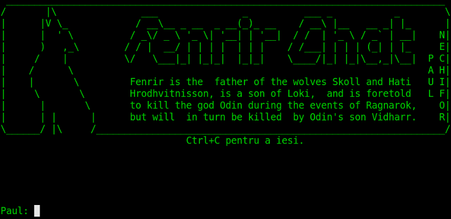

# Fenrir Chat

My first use of BSD sockets to build a chat program for use on the students'
server (`fenrir.info.uaic.ro`) at [FCS][fcs] in 2009.

It's actually pretty shitty. Even the teaching assistent laughed at my use of
polling.

## Licence

MIT

[fcs]: http://www.infoiasi.ro/bin/Main/?language=en
